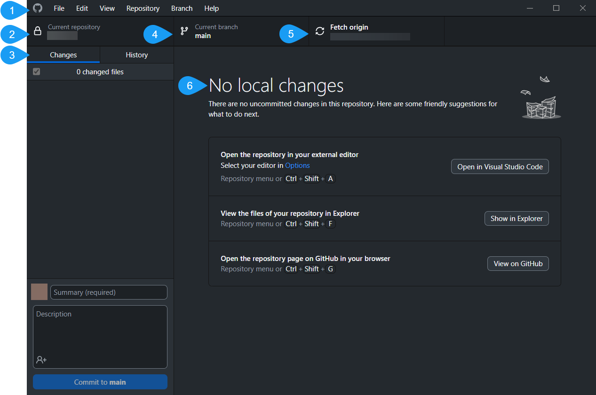

# GitHub Desktop - Published Repository Main Page Overview 

## Introduction

The following concept topic presents an overview of the repository main page in GitHub Desktop application and its core elements. 

## GitHub Desktop Repository - Main Page Overview

### 1. Menu Bar

Located at the top of the screen, next to GitHub logo, contains elements such as: 

| Element | Description   |
| ------- | -----------   |
| File | You can create new repository, add repository from your computer or clone repository here. You can also manage options here or close the window.|
| Edit | You can modify your changes here by clicking: *Undo*, *Redo*, *Cut*, *Copy*, *Paste*, *Select All*, *Find*.    |
| View | You can click here if you want to see: *Changes*, *History*, *Repository List*, *Branches List*, *Summary*, *Stashed changes*, or resize window. |
| Repository| You can Push, Pull, Fetch or remove changes here. You can also open the repository using various tools, create issue or change repository settings. |
| Branch | |
| Help | |

### 2. Repository Bar

Located  at the top of a screen, under **The Menu Bar**, shows current state of repository. It contains such elements as:

| Element   | Description   |
| -------   | -----------   |
| Current Repository | Displays the name of the repository you are currently working on. Clicking on 'Current repository' allows you to change to a different repository. |
| Branch | Displays the name of the branch you are currently working on. Clicking on "Branch' allows you to change a branch ora create new one. |
| Fetch origin | This segment of the toolbar will adapt based on the status of your current branch and repository. Contextual actions will appear, providing options to exchange data between your local and remote repositories. Possible options: *Fetch origin* - means that you can retreive from the published repository. *Push origin* - means that you can push changes to the origin repository. |

### 3. Sidebar 

Located on the left side of a screen show changes that you made in your local repository. It contains such elements as:

| Element   | Description   |
| -------   | -----------   |
|Changes| Indicates the changes you've made to files in your current branch that are still awaiting a commit to your local repository.|
|History| Displays the earlier commits made on the current branch of your repository.|
|Summary| Text box where you can give a name to your changes.|
|Description| Text Box whree you can describe commiting.|
|Commit to main | You can commit your changes here. The button is dynamic and will show the branch to which you're committing your changes.|

### 4. Changes/History View

Located in the middle of the screen. It offers recommendations for potential next actions. In History it shows changed files. 

### Summary