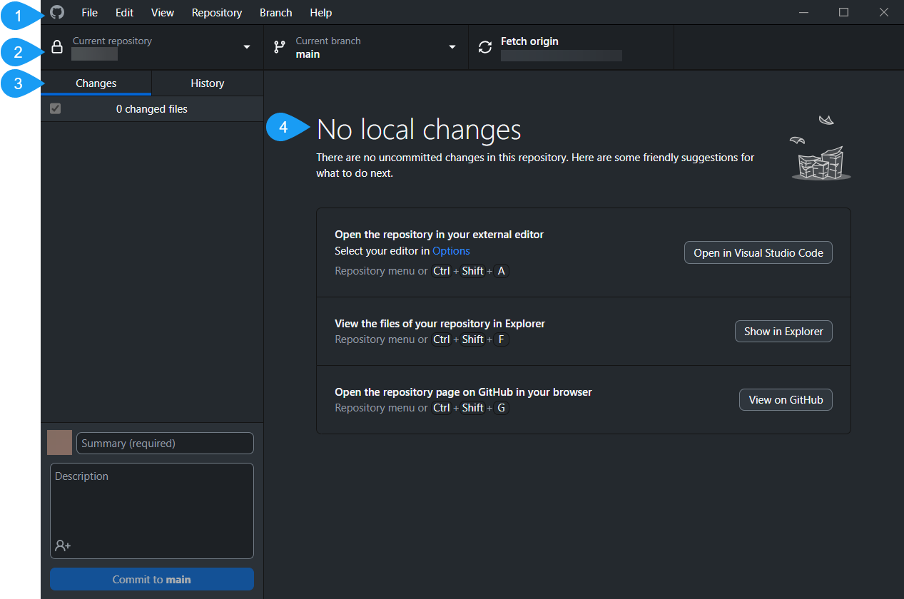

# GitHub Desktop Repository Main Page Overview 

## Introduction

The following concept topic presents an overview of the repository main page in GitHub Desktop application and its core elements. 

## GitHub Desktop Repository - Main Page Overview

### 1. Menu Bar

Located at the top of the screen, next to GitHub logo. Menu Bar contains elements such as: 

| Element | Description   |
| ------- | -----------   |
| File | |
| Edit | |
| View | |
| Repository| |
| Branch | |
| Help | |

### 2. Repository Bar

Located  at the top of the screen, under **Menu Bar**

### 3. Left Sidebar 

### 4. Changes

## Summary